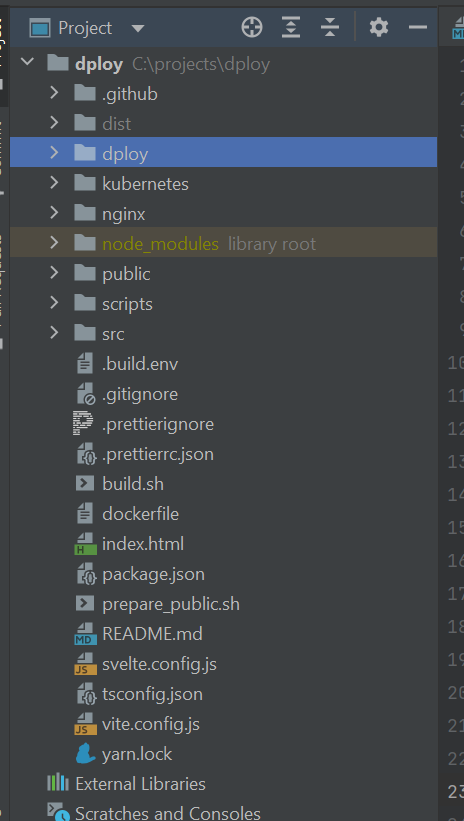
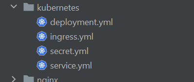

# Build
This repository aims to streamline how every docker based Indico project is buildt. The repository comprises a script
(build.sh)[./build.sh] which kan be added to all Indico projects, as well as clear guides and best practices for structuring,
versioning, and working on Indico projects using Git.

## Versioning
As a general rule every project should try to follow the standard versioning approach for the language chosen for the project.
How a project is versioned is usually determined by the package-manger or framework used by the project. As we try to 
mitigate the need for custom logic in each project, we try to follow the best practises for versioning the individual
projects determined by the package-manager or framework. As of `22.02.22` Indico has 3 projects that targets a container-based
environment:
 - __FT4__: _Ferdig til 4_, is the main backend API written in PHP and JavaScript.
 - __WM4__: _Worker Manager for FT4_, is the file-processing and queue handler for FT4 written in PHP and Python.
 - __Vault__: _Evidence Vault_, is the frontend for FT4 written in TypeScript with Svelte.
 
For __Vault__ this is pretty straight forward as it uses [NPM](https://www.npmjs.com/) as its package-manager which also
handles versioning through its `package.json`. The `package.json` also contains relevant metadata such as a last updated
date, name, and description. These are all useful fields when looking at the project from the outside in, when the final
product is a _docker-image_ it becomes especially useful as we cannot see the actual content of the image before running it.
Metadata on the other hand will be exposed if configured correctly and is in many cases need for the `devops` to be able
to differentiate between the images without having to run them. 

As of `22.02.22` any project that does not utilize a framework or package-manager that handles versioning, defaults to
the _NPM_ format and uses a simplified `package.json`. This is the case for both __WM4__ and __FT4__.

> When updating the version for a project you should start by first committing and pushing all code changes, then
> perform the version update, commit and push the affected files, and finally tag this commit with new version.

For all projects the version format is written as `Major.Minor.Patch-Tag.Number`:
 - _Major_: The major version of the project, should only be updated on completion of breaking changes.
 - _Minor_: Updated with each new feature, this could introduce breaking changes.
 - _Path_: Updated with each fix, minor changes to documentation etc., and should never introduce breaking changes.
 - _Tag.Number_: These two should always be combined when used, and is to be appended when testing code introduced under  
                 one of the above version changes. It can also be used to identify a version containing code that differs
                 from the main code base. As an example here vi have the latest __Database__ image used by _PIT_, this has  
                 some customer specific _SQL_ witch in turn is reflected in the version _Tag_ (`1.1.0-pit`). Notice that
                 we never write the _Tag_._Number_ as `00`, we just leave it blank. If the code specific to _PIT_ in the 
                 __Database__ image is updated the next version would be `1.1.0-pit.1`, if the main codebase is _patched_
                 the next version would be `1.1.1-pit`.

In many cases where it is necessary to perform continuous tests of build pipelines or deployment logic we might
have to update the version number rapidly in order to trigger a new build. As this does not relate to changes in
the main code-base, we just update the _Tag.Number_ for  the project, this tells the _DevOps_ that the code itself 
has not changed but some part of the pipeline or other build-logic has. Some keywords used in tag such as `alpha` or 
`beta` tells us that the current version is at a testing stage. The current version of the __FT4__ image for example 
is now at `0.9.8-beta.50`, this is interpreted as the main code-base being at version `0.9.7` while the version `0.9.8`
is at `beta` testing stage on its 50th build. Tag names should always be lower-case.

A good rule of thumb is here to write out some documentation per repo defining possible keywords to be used as a _Tag_
and what these tags mean. This makes it easy for any _DevOps_ to determine what to name test images and how to interpret
existing image versions. 

Some commonly used tag names are:
 - _alpha_: An early test build with high probability of failure.
 - _beta_ : A step-up from _alpha_ when the build has matured and has a lower probability of failure.
 - _pipe_ : Marks the testing of a pipeline and does not affect the main code base.

### Update Version
For each container-based project there should be a `update_version.sh` script in the root. This script can be called directly
to update the version of the individual projects without triggering anything else, and is also called from `build.sh` when
updating the version. This script may differ in functionality based on how versioning is done for the project.

As an example is the included `update_version.sh` for __FT4__ which follows the rules for versioning mentioned above,
as well as performing some custom logic for updating a version file within the project. This example outlines how a 
version and when update should be performed:

```shell
#!/bin/bash
# The first line in any script should be a `shebang` which tells the interpreter what runner to use.
# All Indico images as of 22.02.22 includes Bash and should match the line above for all scripts.

if [ -f ".build.env" ]; then #Checks for the local .build.env file
  source .build.env #Loads the local .build.env file values if it exists.
fi

for arg in "$@"; do #Itterates arguments passed to the script
  case "$arg" in
  *) # Interprets any argument as next_version, passing multiple arguments to the
    next_version=$arg
    ;;
  esac
done

if [ -z "$next_version" ]; then # Checks if the next version has been sat
  echo " - error: You need specify a version to update it..."
  exit 1
fi

# The info file in FT4 is not interest in the `Tag.Number` part of the version, so we strip this away.
echo " - Stripping version flags"
next_version=(${next_version//-/" "})
next_version="${next_version[0]}"
flags=${next_version[1]}
if [ -n "$flags" ];then
  echo " - Removed: \"$flags\""
fi

# Only matches the current version system, will stripp everythng after a "-"
if ! [[ "$next_version" =~ ^[0-9]\.[0-9]\.[0-9]$ ]]; then
  echo " - error: Invalid version format \"$next_version, should be \"0.1.0\""
fi

if [ ! -f "$FT4_INFO_PATH" ]; then # Checks if the info file exists at the given location in .build.env
  echo " - error: no FT4 info can be found at $FT4_INFO_PATH ..."
  exit 1
fi

vs_seg=(${next_version//./" "})

echo " - Updating $FT4_INFO_PATH to version $next_version"

function update_vs() { # Performers the actual version update with jq
  jq \
    --arg major "${vs_seg[0]}" \
    --arg minor "${vs_seg[1]}" \
    --arg patch "${vs_seg[2]}" \
    --arg date "$(date +%F)" \
    '.version.major = ($major | tonumber) | .version.minor = ($minor | tonumber) | .version.patch = ($patch | tonumber) | .version.date = $date' \
    "$FT4_INFO_PATH"
}

vs=$(update_vs)
echo "$vs" > "$FT4_INFO_PATH" # Saves the new version to the info.json file

echo " - Version updated to $next_version"
exit 0
```
The simplified `package.json` used by __FT4__:
```shell
{
  "name": "ft4", # Lower-case public name.
  "version": "0.9.8-beta.46", # The full version.
  "versionDate": "2022-02-18" # Date when the version was last updated.
}
```

## Project structure
To improve readability and streamline image building and kubernetes deployment automation we should strive as much as
possible to maintain the same project structure across all container-based projects. If the project is using a package
manager or framework, chances are that the project is already following the best practices for `project-structure`. Only
a few older solutions still stuck in time deviates from this. 

Furthermore, the projects should contain one project and one project only. When developing for a container-based 
environment the final deployment does only work with one single foreground runner. This means that after the pod
starts up it is tied to s single executable which it also binds its lifecycle to. Resulting in the pod stopping when
the executable completes or crashes.

A well-structured project should look something like this:  



From the above picture we find all configurations, external scripts and assets at root level. While all code lives in 
the `src` folder, this folder could be given any name as long as it hits towards containing the source code for the 
project. Commonly used names are `src` or `app`. Following this approach increases readability and allows us to easily 
locate cache folders and personal configurations or environment files. 

In the root of all projects as with the example above we find the `package.json` which is the default project-descriptor
and versioning file for all Indico projects per `23.02.22`. The contents of said file looks something like this: 
```json
{
  "name": "dploy",
  "version": "0.1.13",
  "versionDate": "2022-02-23",
  ...
}
```
Here we can easily determine the version, last updated version data, and project name from the file. Internal Indico 
scripts such as `build.sh` utilize this to update and parse versions for the project by default. 

### Kubernetes
Projects that are hosted in _Kubernetes_ have a special folder `kubernets` at project root. This is where all `.yaml`
files related to the running deployment are stored. For the [dploy](https://github.com/IndicoSystems/dploy) repository
the content of the `kubernetes` folder looks like this:  



The files in the above image is always the currently deployed files for the project in _Kubernetes_. As they are kept
in the project root and in the same repository as the project itself, it forces the developer to always commit 
changes made to the `.yaml` files to the remote. This in turn ensures that everyone is working on the same version of
the _Kubernetes_ resources when making changes in _Kubernetes_. Finally, internal Indico scripts such as `build.sh` 
utilizes this to automatically update the images used by `kubernetes/deployment.yaml` when the following two flags are 
sat:
```env
# Enables kubernetes publishing
BUILD_IMAGE_KPUB=1
# Enables kubernetes deployment update with new image version
BUILD_IMAGE_KUBER=1
```

## build.sh
build.sh is a simple bash-script that is to be added into the root of any container-based Indico-project. The intention
of this script is to simplify the way _Docker-Images_ are built and published. In addition, the script also
updates project versions and commits the final result for _Git_ on a successful build.

For the script to work properly you will have to follow the above project structure and versioning guidelines. With 
your container-based project structured correctly, you download and configure the `.build.env` from this repo.

### Dependencies
For `build.sh` to work correctly you will need a couple of system known commands and the official command-line tool from
_DigitalOcean_ `doctl`. The following is the current requirements for the script:
1. __dotcl__: Used for communicating with the _DigitalOcean_ container-registry, follow the Indico guide for installing 
            and configuring this [here](https://dploy.indico.dev/#/digitalocean).
2. __docker__: Required for building docker images, follow the Indico guide for installing and configuring 
             this [here](https://dploy.indico.dev/#/docker)
3. __jq__: Used for parsing `json` from commandline, download this with your favorite package manager or see the 
           official [docs](https://stedolan.github.io/jq/) for installation. 

### Commands
The script comprises a couple commands and a lot of flags. All flags mentioned here have a matching variable in the 
`.build.env` so that you don't have to append all flags each time you run the script. Some values are not possible to 
set through the command-line as they are the same between projects, and should therefore be sat in the `.build.env` file.

Running `build.sh` with the `-h` flag will take you to an internal help screen which briefly explains the different 
flags, see the section below. Running `build.sh --help` will take you to this documentation screen in your browser.

```shell

    ██████╗ ██╗   ██╗██╗██╗     ██████╗
    ██╔══██╗██║   ██║██║██║     ██╔══██╗
    ██████╔╝██║   ██║██║██║     ██║  ██║
    ██╔══██╗██║   ██║██║██║     ██║  ██║
    ██████╔╝╚██████╔╝██║███████╗██████╔╝
    ╚═════╝  ╚═════╝ ╚═╝╚══════╝╚═════╝

        © 2022 Indico Systems AS
           All rights reserved

A simple helper script for building and publishing almost
all indico software. The usage of this script is the same
across all repositories, and it depends on doctl and docker
For more information, questions or documentation pleas
contact your friendly neighbourhood Martin.

Requirements:
 - doctl : DigitalOcean command line interface, see install
           guide at https://dploy.indico.dev/#/digitalocean
 - docker: Docker runner, for windows this should be Docker-
           Desktop, guide at https://dploy.indico.dev/#/docker
 - jq:   : Json command line parser, required to update version
         : see docs to install https://stedolan.github.io/jq/

Eks: ./build.sh 0.1.5-beta.5 -p --kuber --node --kpub -y

Usage:
  -h,H          : Help, shows usage.
  --help        : Opens the full documentation page for this script at
                  https://dploy.indico.dev/#/build.
  -y,Y          : Auto accepts image overwrite and reusing existing
                  build version.
  -p, --publish : Publishes the docker image to the do-reguistry upon
                  build completion
  --kuber       : updates kubernetes deployment file with the new version.
                  NB, requires yq https://mikefarah.gitbook.io/yq/
  --node        : Updates package json with the new version number.
                  NB, requires jq https://stedolan.github.io/jq/
  --kpub,kpop   : Applies the kubernetes deployment changes with kubectl.
                  This requires kubectl to be installed and configured with
                  the correct kubernetes cluster. Remember to sett the
                  correct namespace
  --tag         : Add and commits the updated resources post build, pushes
                  the commit, and finally tags and pushes this final commit
                  with the new version.
  v, version    : Displays the last built and published version name according
                  to this repo.
  -v,--version  : Displays the last built version, and just the version.
```

From the help section above everything except `--help, --version` starting with `--` has a matching env variable
in the `.build.env` file, and it is recommended to set these there to ensure consistency across builds. Calling the
script with `v` or `version` will display the current version and last updated date, while running it with `-v` or 
`--version` will display only the version. 

### .build.env
The `.build.env` file is an Indico-environment file read by `build.sh`. For every container-based project using 
`bash.sh` you will need to create, download, or copy this into the root of the project. Included in this repository is a 
preconfigured and documented version of said file, which looks as followed:
```dotenv
# The docker container registry to push to
BUILD_REGISTRY_NAME="registry.digitalocean.com/indico"
# The name of the image
BUILD_IMAGE_NAME=indico-dploy
# If present the build script will override, and change the kubernetes context
# before applying any resources, the scrit will then shift back to the original context.
BUILD_KUBE_CONTEXT=dploy
# Git commit message, the default message to show with the commit published trough --tag
BUILD_GIT_MESSAGE="built new version"
# Default for all flags are 1 = enabled, and 0 = disabled
# Enables kubernetes publishing
BUILD_IMAGE_KPUB=1
# Enables kubernetes deployment update with new image version
BUILD_IMAGE_KUBER=1
# Enables node version update in package.json
BUILD_IMAGE_NODE=1
# Enables publishing of image to sat registry
BUILD_IMAGE_PUBLISH=1
# Enables git commit and tagging after updated versions
BUILD_GIT_TAG=1
# Enables auto-accept for all yes/no questions
BUILD_ALLOW=1
# The location of package.json or version file of same format, usually "./package.json"
BUILD_PROJECT_FILE="./package.json"
# Following two variables are commands, these can be a path to another bash script or and inline command.
# Additional version update command. The command specified will be called with the rsolved version as an argument.
BUILD_ADDITIONAL_VERSION=./update_version.sh
# Additional build commands, this is where you would insert "yarn build" etc. Leave empty for none.
BUILD_EXEC="yarn install && yarn build"
```
#### BUILD_REGISTRY_NAME
This is the container-registry for where to push a built docker image to on a successful build. This is required 
regardless of the flag `BUILD_IMAGE_PUBLISH` being sat or not, as docker needs this information in order to tag the
images correctly.

#### BUILD_IMAGE_NAME
The actual shorthand name of the image, this should be kept as short as possible and not contain any special characters
except for `-`. As of `25.02.22` these names are _ft4_ for FT4, _wm4_ for WM4, and _vault_ for Vault. For the majority 
of projects this is the only value you will need to update. Be careful to remember doing this with each new project
as giving this the wrong name will result in the pushed image overwriting another image.

#### BUILD_KUBE_CONTEXT
The context name to use with `kubectl` when performing an auto-update of a related kubernetes deployment. This is only
relevant for projects following the projects structure mentioned above, and has a valid `/kubernetes/deployment.yaml`
file at the root of the project. This field is only read when the flags for updating Kubernetes resources 
`BUILD_IMAGE_KUBER`, or publishing Kubernetes resources `BUILD_IMAGE_KPUB` is sat. If you are going to use this
have a quick look at the [Kubernetes guide](https://dploy.indico.dev/#/kubernetes) first.

#### BUILD_GIT_MESSAGE
This is the commit message used when the flag `BUILD_GIT_TAG` is enabled. This can only be a string. 

#### BUILD_IMAGE_KPUB
Enables publishing with the Kubernets context sat with `BUILD_KUBE_CONTEXT`. This is tightly tied to the resource
being published having actually been updated, and should be sat to `0` unless `BUILD_IMAGE_KUBER` is sat. Requires
the project to have a `/kubernetes/deployment.yaml` file.

#### BUILD_IMAGE_KUBER
When enabled it will update the `/kubernetes/deployment.yaml` file with the newly built version on a successful build. 
As mentioned above, this requires the project to follow the guidelines for good project-structure for this to work. 
It is recommended to keep this flag sat to `1` if the project has a `/kubernetes/deployment.yaml` file, in order to keep
the internal Kubernetes resources up to date with the last built version.

#### BUILD_IMAGE_NODE
When enabled will try to update a node-like version file following the general structure of an _NPM-package.json_. The
file path to the file updated is unless specified sat to `./package.json`, but can be overwritten by changing the 
`BUILD_PROJECT_FILE` value.

#### BUILD_IMAGE_PUBLISH
With this enabled, `build.sh` will on a successful build publish the resulting docker image to the container-registry
specified with `BUILD_REGISTRY_NAME`.

#### BUILD_GIT_TAG
Enabling this will on a successful build commit the changed files with the message sat to `BUILD_GIT_MESSAGE`. Then it
will push this commit to the repo, and finally create and publish a _Git-tag_ at the same point with the new version 
name. When using this remember to always commit and push all code related changes, see the [Git guide](https://dploy.indico.dev/#/kubernetes) 
for best precises around this. This is highly recommended using as it ensures that there is always a versioned 
_Git-tag_ matching the image-version-name in the git history.

#### BUILD_ALLOW
Enabling this bypasses all prompts `build.sh` should give, and auto-accepts everything. Setting this to `1` is the
same as running `./build.sh` the `-y` flag, eks: `./build.sh 0.1.1 -y`.

#### BUILD_PROJECT_FILE
This is the location of the _NPM-package.json_ like file holding the project info and version. When not present in the 
`.build.env` file, the `BUILD_PROJECT_FILE` variable will default to `./package.json`. This is also the default location 
from _NPM_ and good project structure guid above for said file.  

#### BUILD_ADDITIONAL_VERSION
This could be a command or path to an external script that gets called by `build.sh`. If not present this step will be 
skipped in `build.sh`. Use this to update addition versioning files within the source code on a new build. In this 
repository there is included two examples of this, one for dploy `update_version.sh`, and one for ft4 `update_version_ft4.sh`
The newly resolved version name will be passed as an argument to the script or command specified here.

#### BUILD_EXEC
This is the pre docker build step, and is called after all version updating is done, both node and additional, but before
the docker image is built. This allows you to run commands such as `yarn build` before the docker build starts with the
new version name updated. Should the command or script placed here fail with an error `>= 1` will cause the `build.sh`
to stop and exit with error code 1, when `BUIL_EXEC` is specified it will have to succeed for `build.sh` to complete.
If you do not wish to use `BUILD_EXEC`, then remove it completely in the project `.build.env`.

# Enables kubernetes deployment update with new image version
BUILD_IMAGE_KUBER=1

guidelines for good project structure mentioned above, this script capable of updating project versions, build it's 
source-code, building a docker image of the `Dockerfile`

```shell

# Shared version update logic
if [ "$BUILD_IMAGE_NODE" -eq 1 ]; then
  echo "### Updating node version"
  curr_date=$(date +"%Y-%m-%d") #Retrieves the current date
  contents=$(jq --arg vs "$BUILD_IMAGE_VERSION" --arg date "$curr_date" '.version = $vs | .versionDate = $date' package.json) #Updates the new version in package json
  echo "${contents}" >package.json
  echo " - updated date and version in package.json"
  echo " "
fi
```

### Docker
If any errors should appear related to the docker build-step, or something seems fishy after the build has completed, 
you can run the following command to remove all previously cached docker images:
```shell
docker rmi -f $(docker images -q -a)
```

If the errors persist try removing the latter `FROM` parts from the `Dockerfile`, run the above command again, and then
try rebuilding the image.